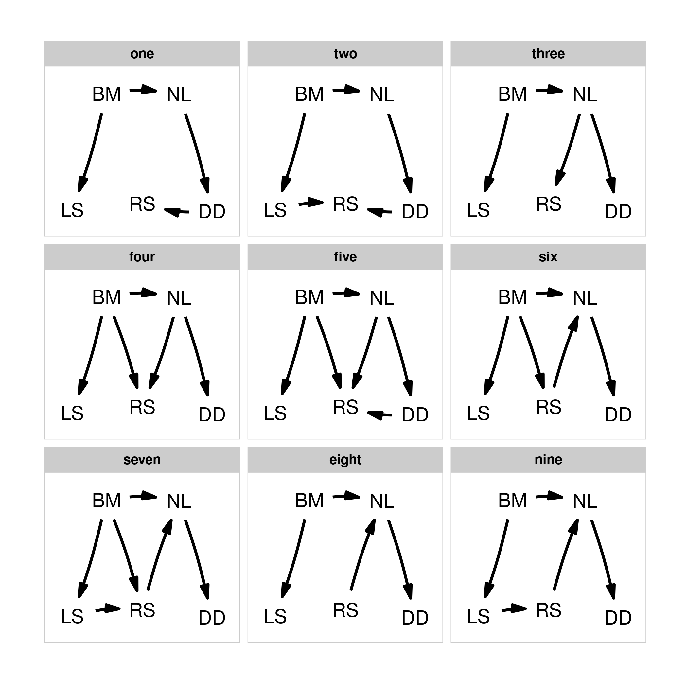
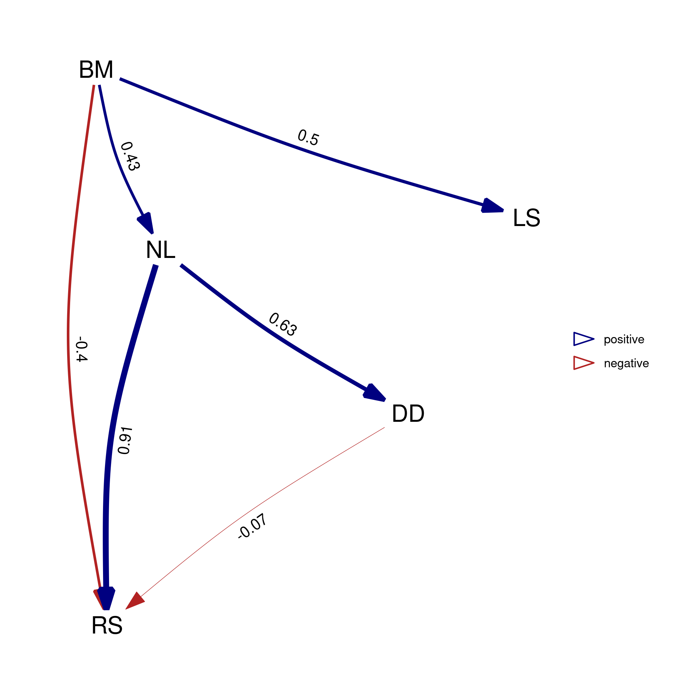

# Easy phylogenetic path analysis in R

Use the `phylopath` package for an easy to use framework to perform
phylogenetic path analysis (PPA).

PPA can be used to compare support for competing causal models of trait
evolution, while taking shared ancestry into account. All you need is:
1. A clear set of models to test. 2. A data set of species with trait
values. 3. A phylogeny of your species.

For a complete worked example, click “Get Started” above, or see the
[PeerJ paper](https://doi.org/10.7717/peerj.4718).

This method was developed by Von Hardenberg and Gonzalez-Voyer. See
`citation()` for info on correct citations.

The following published papers use `phylopath` (not up-to-date):

*2019*

-   Scholer, M. N., Arcese, P., Puterman, M. L., Londoño, G. A. &
    Jankowski, J. E. Survival is negatively related to basal metabolic
    rate in tropical Andean birds. *Functional Ecology* (2019) 00:1–10
    [doi:10.1111/1365-2435.13375](https://doi.org/10.1111/1365-2435.13375)

-   Iglesias-Carrasco, M., Jennions M. D., Ho S. Y. W. & Duchêne, D. A.
    Sexual selection, body mass and molecular evolution interact to
    predict diversification in birds. *Proceedings B* (2019),
    286: 20190172.
    [doi:10.1098/rspb.2019.0172](https://doi.org/10.1098/rspb.2019.0172)

-   Guo W.‐Y., van Kleunen M., Pierce S., *et al.* Domestic gardens play
    a dominant role in selecting alien species with adaptive strategies
    that facilitate naturalization. *Global Ecol Biogeogr* (2019),
    00:1–12. [doi:10.1111/geb.12882](https://doi.org/10.1111/geb.12882)

*2018*

-   Santini, L., González‐Suáre, M., Russo, D., Gonzalez-Voyer, A., Von
    Hardenberg, A. & Ancilotto, L. One strategy does not fit all:
    determinants of urban adaptation in mammals. *Ecol Lett* (2018).
    [doi:10.1111/ele.13199](https://doi.org/10.1111/ele.13199).

-   Kennedy, J. D., Borregaard, M. K., Marki, P. Z., Machac, A.,
    Fjeldså, J., and Rahbek, C. Expansion in geographical and
    morphological space drives continued lineage diversification in a
    global passerine radiation. *Proceedings B* (2018): 285.
    [doi:10.1098/rspb.2018.2181](https://doi.org/10.1098/rspb.2018.2181).

-   Liedtke, H. C., Gower, D. J., Wilkinson, M. & Gomez-Mestre, I.
    Macroevolutionary shift in the size of amphibian genomes and the
    role of life history and climate. *Nature Eco Evo*. (2018).
    [doi:10.1038/s41559-018-0674-4](https://doi.org/10.1038/s41559-018-0674-4).

-   Murali, G., Merilaita, S. & Kodandaramaiah, U. Grab my tail:
    Evolution of dazzle stripes and colourful tails in lizards. *J Evol
    Biol* (2018).
    [doi:10.1111/jeb.13364](https://doi.org/10.1111/jeb.13364).

-   Mellor, E., McDonald Kinkaid, H. & Mason, G. Phylogenetic
    comparative methods: Harnessing the power of species diversity to
    investigate welfare issues in captive wild animals. *Zoo biology*
    (2018). [doi:10.1002/zoo.21427](https://doi.org/10.1002/zoo.21427).

-   Braga, M. P., Araujo, S. B. L., Agosta, S., Brooks, D., Hoberg, E.,
    Nylin, S., Janz, N. & Boeger, W. A. Host use dynamics in a
    heterogeneous fitness landscape generates oscillations in host range
    and diversification. *Evolution* (2018).
    [doi:10.1111/evo.13557](https://doi.org/10.1111/evo.13557).

-   Basset, Y., Dahl, C., Ctvrtecka, R., *et al.* A cross‐continental
    comparison of assemblages of seed‐ and fruit‐feeding insects in
    tropical rain forests: Faunal composition and rates of attack. *J
    Biogeogr.* (2018) 00:1–13.
    [doi:10.1111/jbi.13211](https://doi.org/10.1111/jbi.13211)

-   Liao, W. B., Huang, Y., Zeng, Y., Zhong, M. J., Luo, Y. and
    Lüpold, S. Ejaculate evolution in external fertilizers: Influenced
    by sperm competition or sperm limitation? *Evolution* (2018), 72:
    4–17. [doi:10.1111/evo.13372](https://doi.org/10.1111/evo.13372)

-   Lin Zhang, Kun Guo, Guang-Zheng Zhang, Long-Hui Lin and Xiang Ji.
    Evolutionary transitions in body plan and reproductive mode alter
    maintenance metabolism in squamates. *BMC Evo Biol* (2018), 18:45.
    [doi:10.1186/s12862-018-1166-5](https://doi.org/10.1186/s12862-018-1166-5)

-   Xin Yu, Mao Jun Zhong, Da Yong Li, Long Jin, Wen Bo Liao and
    Alexander Kotrschal. Large‐brained frogs mature later and live
    longer. *Evolution.* (2018).
    [doi:10.1111/evo.13478](https://doi.org/10.1111/evo.13478).

Send me a message to add yours to the list.
