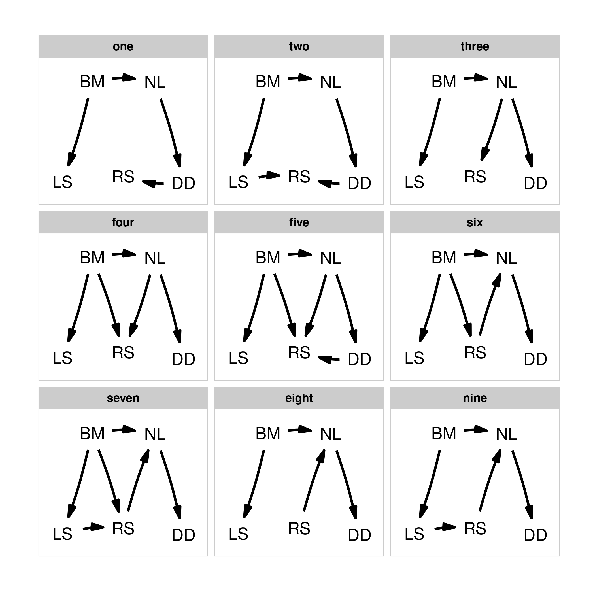

# Easy phylogenetic path analysis in R

Use the `phylopath` package for an easy to use framework to perform
phylogenetic path analysis (PPA).

PPA can be used to compare support for competing causal models of trait
evolution, while taking shared ancestry into account. All you need is:
1. A clear set of models to test. 2. A data set of species with trait
values. 3. A phylogeny of your species.

For a complete worked example, click “Get Started” above, or see the
[PeerJ paper](https://doi.org/10.7717/peerj.4718).

This method was developed by Von Hardenberg and Gonzalez-Voyer. See
`citation()` for info on correct citations.

`phylopath` has been used by [>100 publications](https://scholar.google.ca/scholar?oi=bibs&hl=en&cites=5933615079034924484) so far!
